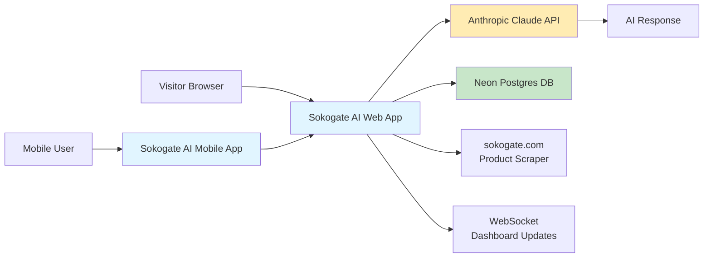
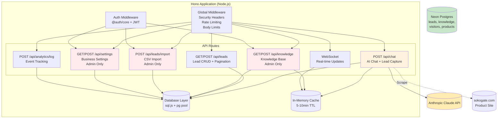

# Sokogate AI - Architecture Documentation

## System Overview

Sokogate AI is a B2B wholesale marketplace AI sales agent that connects African wholesalers with global buyers. The system consists of:

- **Web Application**: React 19 + React Router v7 with Hono backend (Node.js)
- **Mobile Application**: Expo/React Native (iOS & Android)
- **Database**: Neon Postgres (serverless)
- **AI Provider**: Anthropic Claude 3.5 Haiku
- **Realtime**: WebSocket server for live dashboard updates
- **Storage**: Uploadcare for file uploads

---

## System Context (C4 Level 1)



---

## Component View (C4 Level 2) - Web Backend



---

## Data Flow Diagrams

### Chat Request Flow

```
┌──────────┐      ┌─────────────┐      ┌──────────────────┐      ┌──────────────┐
│  Browser │ ───▶ │   Hono API  │ ───▶ │  Anthropic API   │ ───▶ │   Response   │
│  (React) │      │  /api/chat  │      │  Claude 3.5 Haiku│      │  (JSON)      │
└──────────┘      └─────────────┘      └──────────────────┘      └──────────────┘
                            │                       │
                            ▼                       ▼
                    ┌──────────────┐      ┌──────────────────┐
                    │ Rate Limit   │      │  Token Budget:   │
                    │ Check (30/m) │      │  max_tokens=1024 │
                    └──────────────┘      └──────────────────┘
                            │
                            ▼
                    ┌─────────────────────────────────────┐
                    │ 1. Fetch visitor (create/update)    │
                    │ 2. Get knowledge base (cached)      │
                    │ 3. Fetch product data (DB+scrape)   │
                    │ 4. Build system prompt              │
                    │ 5. Call Anthropic with retry        │
                    │ 6. Extract lead data via tokens     │
                    │ 7. Save lead if complete            │
                    │ 8. Broadcast via WebSocket          │
                    └─────────────────────────────────────┘
```

### Lead Import Flow

```
┌──────────┐      ┌─────────────┐      ┌──────────────┐      ┌─────────────┐
│  Admin UI │ ───▶ │  API Route  │ ───▶ │ CSV Parser   │ ───▶ │  PostgreSQL │
│  (File)   │      │ /import/lead│      │  (PapaParse) │      │  (bulk)    │
└──────────┘      └─────────────┘      └──────────────┘      └─────────────┘
                            │                       │
                            ▼                       ▼
                    ┌──────────────┐      ┌──────────────────┐
                    │ Admin Auth   │      │ Validation:      │
                    │ (JWT check)  │      │ - Email regex    │
                    └──────────────┘      │ - Required fields│
                            │            │ - Duplicate check│
                            ▼            └──────────────────┘
                  ┌─────────────────┐             │
                  │ Auth: 401/403   │             │ Error: 400
                  └─────────────────┘             ▼
                                         ┌──────────────────┐
                                         │ Row-by-row       │
                                         │ INSERT (current) │
                                         │ Future: COPY     │
                                         └──────────────────┘
```

---

## Database Schema

### Core Tables

**leads** - Primary lead capture table
- PK: `id` (SERIAL)
- FK: `visitor_id` → visitors.visitor_id
- Indexes: `created_at DESC`, `score`, `status`, `category`
- Partial index: `whatsapp` (where not null)

**visitors** - Anonymous visitor tracking
- PK: `id` (SERIAL)
- Unique: `visitor_id` (string)
- Tracks conversation stage progression

**knowledge_base** - AI knowledge base
- PK: `id` (SERIAL)
- Indexes: `priority DESC`, `category`, `is_active`

**products** - Product catalog from sokogate.com
- PK: `id` (SERIAL)
- Unique: `sku`
- Indexes: `category`, `is_active`, `name`

**business_settings** - Brand configuration
- Single-row table (latest record is active)

---

## Security Architecture

### Authentication & Authorization

```
┌─────────────┐
│  Firebase   │  Client-side auth (email/password, Google)
│   Auth UI   │  → creates @auth/core session
└─────────────┘
      │
      ▼
┌─────────────────┐
│ @auth/core      │  JWT session management via cookies
│   (ADAPTER)     │  → Neon DB: auth_users, auth_sessions
└─────────────────┘
      │
      ▼
┌─────────────────────┐
│  Hono Middleware    │  - getToken() verifies JWT
│  - requireAdmin()   │  - Checks ADMIN_EMAILS env var
│  - rateLimiter      │  - Rate limits per IP/visitorId
└─────────────────────┘
      │
      ▼
┌─────────────────┐
│  Protected API  │  401/403 if auth fails
│   Endpoints     │  429 if rate limited
└─────────────────┘
```

### Rate Limiting Strategy

- **Per-session**: 30 requests / 60 seconds (by visitorId)
- **Per-IP**: 60 requests / 60 seconds (by x-forwarded-for)
- **In-memory store**: Single-instance; for multi-instance, replace with Redis

### Data Protection

- **SQL Injection**: Tagged template queries (`sql` from pg package)
- **XSS**: DOMPurify sanitization on all AI output
- **CSRF**: SameSite=Lax cookies + CORS
- **MITM**: SSL verification (`rejectUnauthorized: true`)

---

## Performance Considerations

### Caching Strategy

```
Knowledge Base:   5min TTL (shared module, invalidated on CRUD)
Product Results: 10min TTL (in-memory per instance)
Visitor Data:    React Query cache (5min stale, 30min GC)
```

### Database Optimization

- Connection pool: 10 connections per pool (main + products DB)
- Indexes on all foreign keys + commonly queried columns
- Pagination on all list endpoints (prevents OOM)
- Bulk operations: To be implemented with `COPY` for CSV import

### Horizontal Scaling

Current state: **Single-instance only**
- In-memory cache not shared
- WebSocket pubsub uses EventEmitter (no Redis adapter)

For multi-instance:
1. Replace in-memory cache with Redis
2. Replace `serverEvents` EventEmitter with Redis pub/sub
3. Use sticky sessions or JWT-based session sharing

---

## Deployment Architecture

```
┌─────────────┐     ┌─────────────┐     ┌─────────────┐
│   cPanel    │────▶│  Node.js    │────▶│  Neon DB    │
│  (Single    │     │  (v20+)     │     │ (Serverless)│
│  Instance)  │     │             │     │             │
└─────────────┘     └─────────────┘     └─────────────┘
       │
       ▼
┌─────────────┐
│ Expo App    │
│  Stores     │
│ (iOS/Android)│
└─────────────┘
```

**Build Process:**
1. `npm run build` → creates production bundle in `apps/web/build/`
2. Upload `build/` folder + `node_modules` to cPanel
3. Start server: `node build/server/index.js`

**Recommended:** Migrate to Docker + container orchestration (ECS, Kubernetes) for scalability.

---

## Environment Variables Reference

See `.env.example` for full list.

**Required:**
- `DATABASE_URL` - Neon connection string
- `ANTHROPIC_API_KEY` - Claude API key
- `AUTH_SECRET` - 32+ byte random string
- `ADMIN_EMAILS` - Comma-separated admin user emails

**Firebase (Client):**
- `VITE_FIREBASE_API_KEY`
- `VITE_FIREBASE_AUTH_DOMAIN`
- `VITE_FIREBASE_PROJECT_ID`
- `VITE_FIREBASE_STORAGE_BUCKET`
- `VITE_FIREBASE_MESSAGING_SENDER_ID`
- `VITE_FIREBASE_APP_ID`

---

## API Rate Limits

| Endpoint | Limit | Scope |
|----------|-------|-------|
| `POST /api/chat` | 30/min | Per visitorId |
| `POST /api/chat` | 60/min | Per IP |
| All other endpoints | Unlimited | (protected by auth where needed) |

---

## Error Handling Strategy

- **Client errors (4xx)**: Validation errors return structured `{ success: false, error, details }`
- **Server errors (5xx)**: Logged with stack trace in dev, generic message in prod
- **Rate limits (429)**: Include `Retry-After` header and JSON body with reset info

---

## Monitoring & Observability

**Current:** Basic console logging

**Recommended additions:**
- Structured logging (Winston/Pino) → JSON logs
- Error tracking: Sentry (frontend + backend)
- Metrics: Prometheus + Grafana (request rate, latency, error rate)
- APM: DataDog or New Relic for transaction tracing

---

## Future Architecture Improvements

1. **Redis Layer** - For cache & pub/sub
2. **API Versioning** - `/api/v1/...` to allow breaking changes
3. **Event Sourcing** - Immutable event log for audit trail
4. **Microservices Split** - Separate chat service, lead service, analytics
5. **GraphQL Gateway** - Consolidate API endpoints (optional)
6. **CI/CD Enhancements** - Automated deployments on merge to main

---

*Last updated: 2026-05-12*
